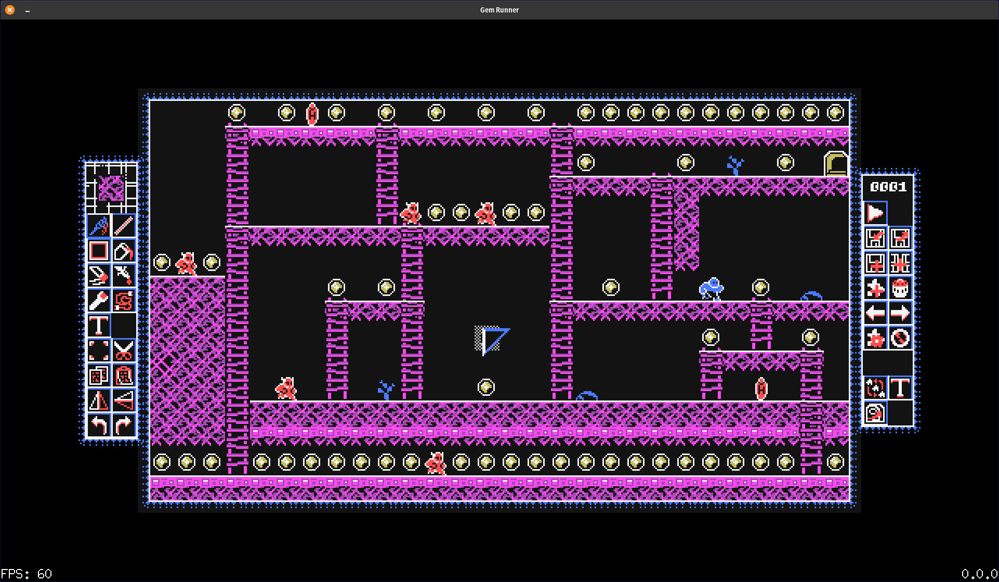

# Gem Runner

This is a game being developed using the pixel-go library originally by faiface.

Currently includes a robust level editor and fully functioning gameplay.

* Enemies
* Items that can be picked up and used
* Jumping
* and more

### Links

[Pixel-Go](https://github.com/gopxl/pixel)  
[Art by Dani Maccari](https://dani-maccari.itch.io/redblu-retrotileset)  